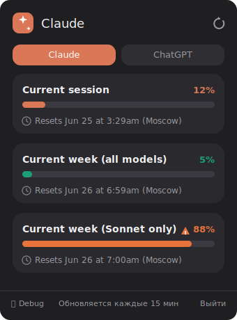
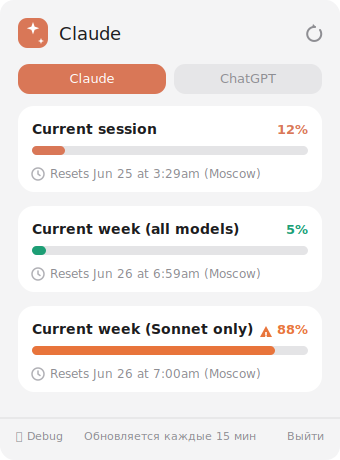
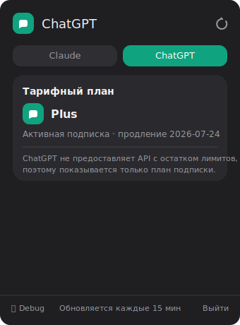

# Tally 📊

Menubar-приложение для macOS, которое показывает лимиты использования **Claude** прямо в строке меню. Для **ChatGPT** отображается тарифный план (OpenAI не отдаёт остаток лимитов через API).

- **Claude** — три полоски лимитов: текущая сессия, неделя (все модели), неделя (Sonnet) — с процентами и временем сброса.
- **ChatGPT** — текущий тарифный план и статус подписки.

Интерфейс в стиле iOS 18: цветные карточки, фирменные акценты, тёмная и светлая темы.

---

## Дизайн

<table>
  <tr>
    <td align="center"><b>Claude · тёмная</b></td>
    <td align="center"><b>Claude · светлая</b></td>
    <td align="center"><b>ChatGPT · план</b></td>
  </tr>
  <tr>
    <td></td>
    <td></td>
    <td></td>
  </tr>
</table>

> Карточки метрик с фирменными цветами (сессия — терракота, неделя — зелёный, Sonnet — синий), при заполнении >80% бар и процент становятся оранжевыми, >95% — красными.

---

## Требования

- macOS 13.0 (Ventura) или новее
- Xcode 15+ (только для сборки из исходников)

---

## Запуск для тех, кто склонировал репозиторий

```bash
git clone https://github.com/OlegZhatkin/Tally.git
cd Tally
```

Дальше есть два пути.

### Вариант A — открыть в Xcode (проще всего)

```bash
open AIUsageBar.xcodeproj
```

В Xcode нажми **`Cmd + R`** (Run). Приложение запустится, и в строке меню появится иконка-график.

> При первом запуске Xcode может попросить выбрать **Team** для подписи: вкладка проекта → target **AIUsageBar** → **Signing & Capabilities** → выбери свой Apple ID (Personal Team хватит). Платный аккаунт разработчика не нужен.

### Вариант B — собрать `.app` / `.dmg` из терминала

```bash
./build_dmg.sh
```

Скрипт соберёт Release-версию и создаст **`AIUsageBar.dmg`** в корне проекта. Открой его и перетащи **AIUsageBar.app** в папку **Applications**.

Готовый `.app` без DMG лежит после сборки тут:
`build/Build/Products/Release/AIUsageBar.app`

---

## Первый запуск (важно про Gatekeeper)

Приложение подписано **ad-hoc** (без сертификата Apple Developer), поэтому при первом открытии macOS предупредит, что разработчик не проверен. Это нормально. Открой один раз так:

1. **Правый клик** по `AIUsageBar.app` → **«Открыть»**.
2. В диалоге снова нажми **«Открыть»**.

Если всё равно блокирует: **Системные настройки → Конфиденциальность и безопасность** → внизу кнопка **«Всё равно открыть»**.

Альтернатива одной командой:

```bash
xattr -dr com.apple.quarantine /Applications/AIUsageBar.app
```

После первого раза приложение открывается обычным двойным кликом.

---

## Как пользоваться

1. Запусти приложение — в строке меню появится иконка-график (у приложения нет окна в Dock, оно живёт в menubar).
2. Кликни по иконке — откроется попап.
3. Нажми **«Войти в Claude»** — откроется окно авторизации. Залогинься в свой аккаунт и нажми **«Готово»**.
4. Лимиты подтянутся автоматически. То же самое для вкладки **ChatGPT**.

Данные обновляются каждые 15 минут; кнопка ↻ в шапке обновляет вручную. Кнопка **«Debug»** внизу показывает сырой ответ API — полезно, если что-то не подтянулось.

---

## Как это работает

- Внутри встроенного `WKWebView` открываются `claude.ai` / `chatgpt.com`, используются куки твоей сессии.
- Данные запрашиваются через внутренние API сайтов прямо со страницы (`callAsyncJavaScript`):
  - Claude: `/api/organizations` → `/api/organizations/{id}/usage` (массив `limits`).
  - ChatGPT: `/backend-api/accounts/check/...` (тарифный план).
- Куки и сессия сохраняются между запусками — повторно логиниться не нужно.

---

## Известные ограничения

- Это **неофициальный** клиент: он парсит внутренние API, у которых нет публичных гарантий. При изменении сайтов парсинг может сломаться — тогда смотри панель **Debug** и открывай issue.
- **ChatGPT не предоставляет API с остатком сообщений/лимитов** — поэтому показывается только план подписки, без полосок «осталось N».
- Нужен активный интернет и вход в соответствующий аккаунт.

---

## Лицензия

MIT
