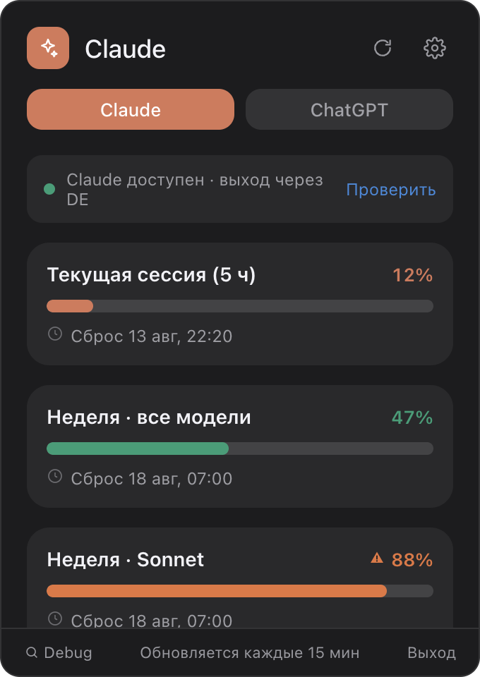
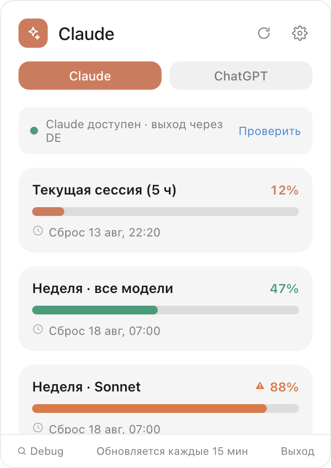
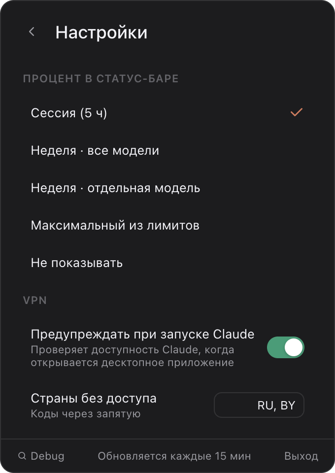
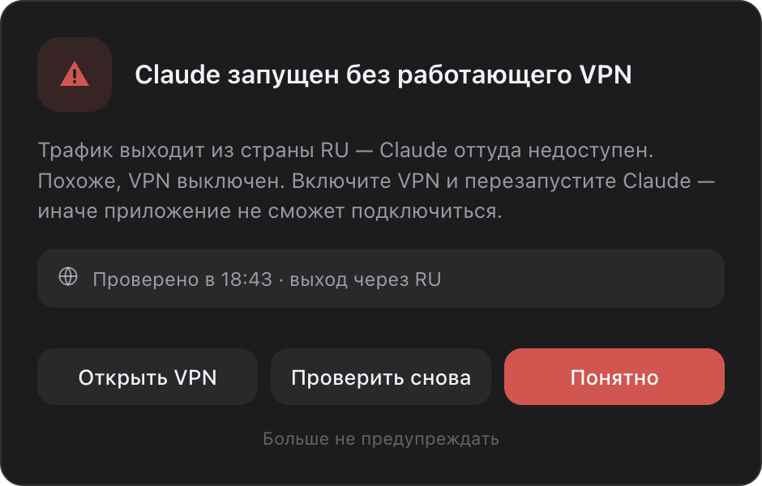

# Tally 📊

Приложение для строки меню (macOS) и области уведомлений (Windows 10/11), которое показывает лимиты использования **Claude**. Для **ChatGPT** отображается тарифный план — остаток лимитов OpenAI через API не отдаёт.

- **Процент выбранного лимита прямо в статус-баре** — сессия (5 ч), неделя или максимум из всех, переключается в настройках.
- **Три полоски лимитов Claude:** текущая сессия, неделя (все модели), неделя (отдельная модель) — с процентами и временем сброса.
- **Предупреждение о VPN:** при запуске десктопного Claude приложение проверяет, доступен ли сервис, и предупреждает, если трафик идёт мимо VPN.

---

## Как выглядит

<table>
  <tr>
    <td align="center"><b>Тёмная тема</b></td>
    <td align="center"><b>Светлая тема</b></td>
    <td align="center"><b>Настройки</b></td>
  </tr>
  <tr>
    <td></td>
    <td></td>
    <td></td>
  </tr>
</table>



> Каждая метрика в своём цвете: сессия — терракота, неделя — зелёный, отдельная модель — синий. Выше 80% бар и процент становятся оранжевыми, выше 95% — красными.

---

## Требования

- **macOS** 11 (Big Sur) или новее
- **Windows** 10 / 11
- Node.js 18+ — только для сборки из исходников

---

## Запуск из исходников

```bash
git clone https://github.com/OlegZhatkin/Tally.git
cd Tally/electron
npm install
npm start
```

Приложение появится в строке меню (macOS) или в области уведомлений (Windows). Окна в Dock и на панели задач у него нет.

## Сборка установщиков

```bash
npm run dist:mac
```

```bash
npm run dist:win
```

Готовые файлы складываются в `electron/release`.

> **Windows-сборку нельзя сделать с macOS** — установщику NSIS нужен wine. Для этого есть GitHub Actions: `.github/workflows/build.yml` собирает обе платформы по тегу `v*` или запуску вручную и кладёт `.dmg` и `.exe` в артефакты.

### Первый запуск на macOS

Приложение подписано **ad-hoc** (без сертификата Apple Developer), поэтому macOS предупредит, что разработчик не проверен:

1. **Правый клик** по `Tally.app` → **«Открыть»**, затем ещё раз **«Открыть»**.
2. Если всё равно блокирует: **Системные настройки → Конфиденциальность и безопасность** → **«Всё равно открыть»**.

Либо одной командой:

```bash
xattr -dr com.apple.quarantine /Applications/Tally.app
```

---

## Как пользоваться

1. Кликните по иконке в статус-баре — откроется попап.
2. Нажмите **«Войти в Claude»**, авторизуйтесь в открывшемся окне. Оно закроется само, как только вход пройдёт.
3. Лимиты подтянутся автоматически и дальше будут обновляться раз в 15 минут (интервал настраивается).

Правый клик по иконке открывает меню: обновить, проверить VPN, выбрать метрику для статус-бара, выход.

### Настройки

| Настройка | Что делает |
|---|---|
| Процент в статус-баре | Какой лимит выводить: сессия (5 ч), неделя (все модели), неделя (отдельная модель), максимум из всех или ничего |
| Предупреждать при запуске Claude | Проверять доступность Claude, когда открывается десктопное приложение |
| Страны без доступа | Коды стран, при выходе из которых считаем, что VPN не работает (по умолчанию `RU, BY`) |
| Интервал обновления | Как часто перезапрашивать лимиты |
| Запускать при входе в систему | Автозапуск |

---

## Как это работает

- Внутри скрытых окон Chromium открыты `claude.ai` и `chatgpt.com` — используются куки вашей сессии, они сохраняются между запусками.
- Данные запрашиваются внутренними API сайтов прямо со страницы:
  - Claude: `/api/organizations` → `/api/organizations/{id}/usage` (массив `limits`).
  - ChatGPT: `/backend-api/accounts/check/...` (тарифный план).
- В статус-баре macOS процент выводится текстом рядом с иконкой. **В трее Windows подписей у иконок нет**, поэтому процент растеризуется прямо в иконку, а подробности показываются в тултипе.

### Как определяется VPN

Проверка идёт по двум независимым сигналам:

1. **Страна выхода** — `cloudflare.com/cdn-cgi/trace`. Если трафик выходит из страны из списка заблокированных, значит VPN выключен. Это главный сигнал.
2. **Реальный ответ claude.ai** — запрос из контекста страницы. Обычным HTTP-клиентом доступность не проверить: Cloudflare отдаёт таким 403 даже при рабочем VPN.

Предупреждение показывается, только когда доступ действительно закрыт. Проверка Cloudflare и обрывы сети дают статус «неизвестно» и пользователя не дёргают.

---

## Известные ограничения

- Это **неофициальный** клиент: он ходит во внутренние API, у которых нет публичных гарантий. Если сайты изменятся, парсинг может сломаться — смотрите панель **Debug** внизу попапа.
- **Cloudflare иногда просит проверку.** Свежая сессия без кук её почти всегда получает, и решается она только в видимом окне. В этом случае попап покажет кнопку «Открыть окно проверки»: окно откроется, проверка пройдёт за пару секунд, окно закроется.
- **ChatGPT не отдаёт остаток лимитов** — показывается только план подписки.
- Предупреждение о VPN появляется **сразу после** запуска Claude, а не до: перехватить запуск чужого приложения нельзя.

---

## Swift-версия (legacy)

Папки `AIUsageBar/` и `AIUsageBar.xcodeproj/` — исходная нативная версия для macOS на SwiftUI. Она работает, но развивается кросс-платформенная версия из `electron/`: SwiftUI и WKWebView на Windows не существуют, портировать было нечего.

---

## Лицензия

MIT
